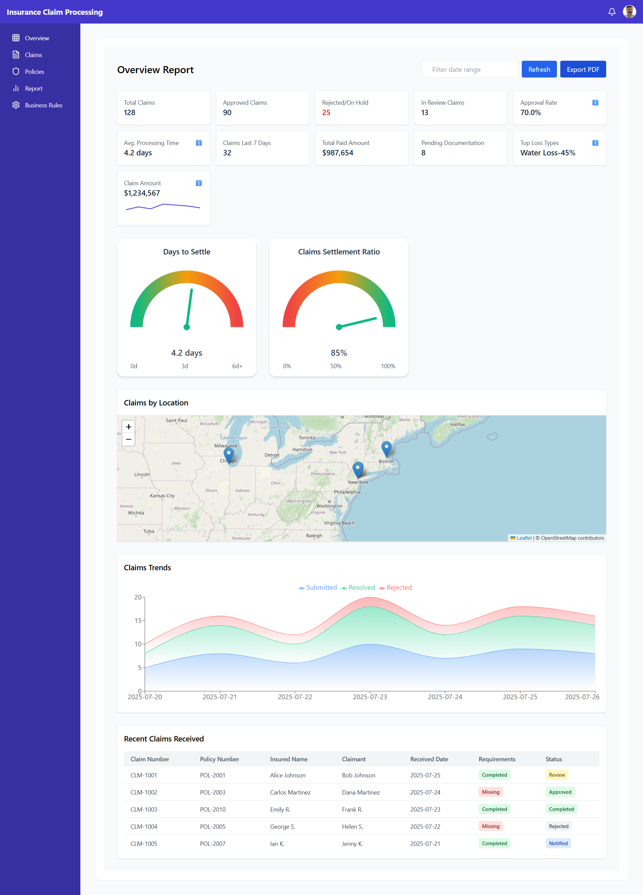
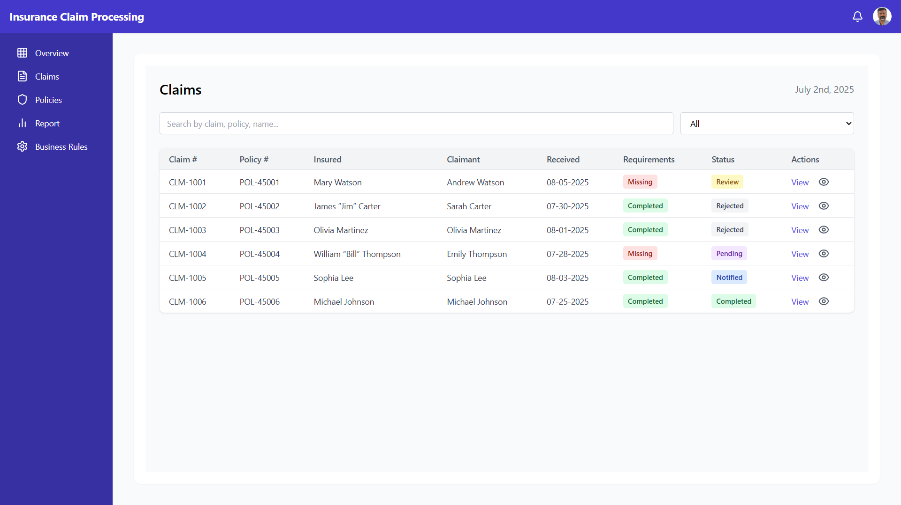
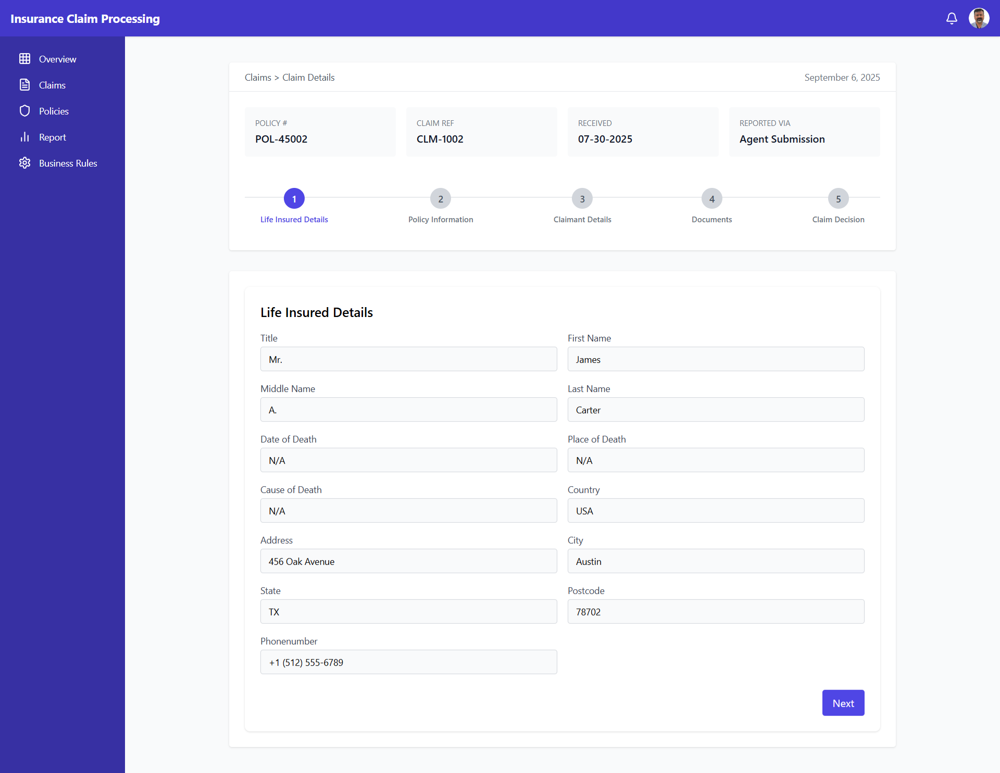
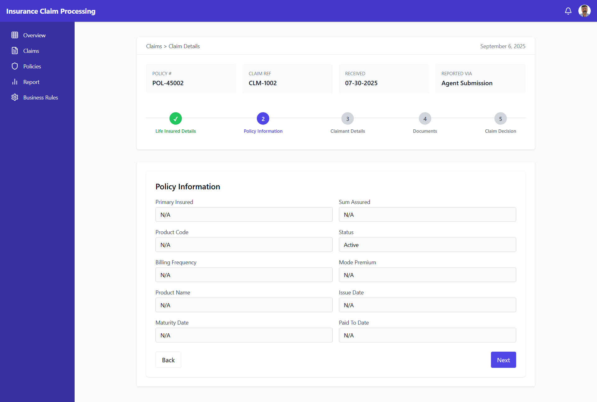
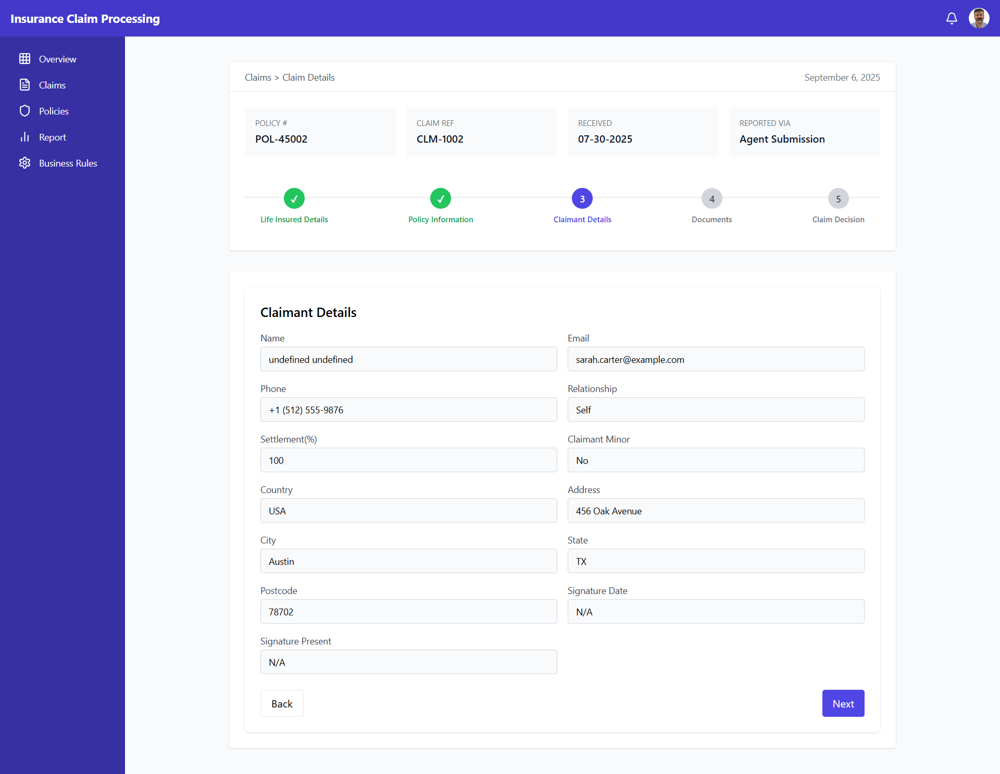
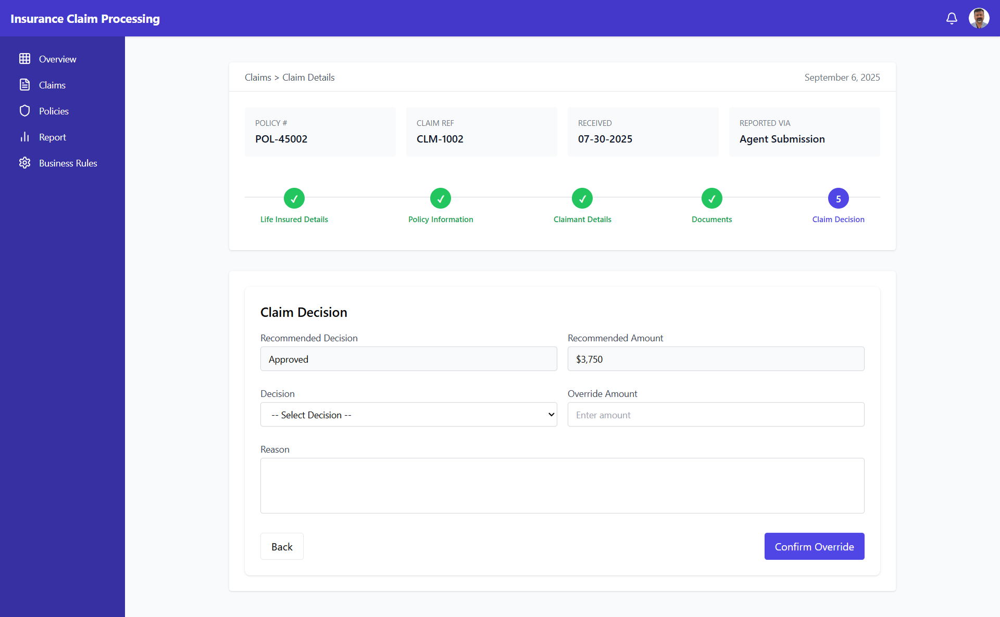
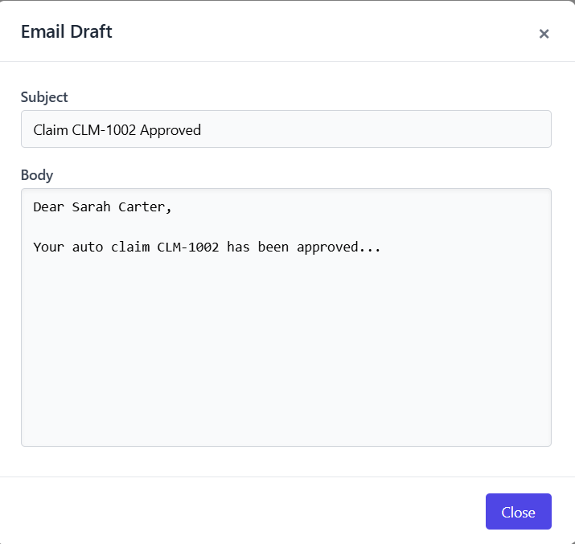
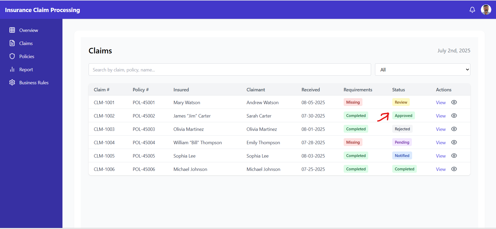

# Agentic Insurance Claim - React Frontend

A **React + TailwindCSS** frontend for the AI-powered Insurance Claim Processing system.

---

## 🚀 Features
- Multi-step Claim Submission Flow
- Dynamic Document Upload & Status
- Email Draft Preview & Notifications
- AI-powered Dashboard with Graphs
- Responsive UI with TailwindCSS

---

## 📦 Installation
```bash
git clone https://github.com/ankit72630/tal-claim.git
cd tal-claim
npm install
npm start
```

---

## 🖥️ Screenshots

### Dashboard


### Claims Recieved Table


### Claim Details
- Life Insured Details  
    
- Policy Information  
    
- Claimant Information  
    
- Documents  
    
- Claim Decision  
    
- Email Draft  
  

### Claim Flow End



---

## 📚 Documentation
Detailed docs are available inside the [`/docs`](./docs) folder.

---

## 🔧 Tech Stack
- React.js
- TailwindCSS
- Context API
- REST APIs Integration

---

## 👨‍💻 Development
- `npm start` → Run locally
- `npm run build` → Production build
- `npm test` → Run tests

---

## 📜 License
MIT License
